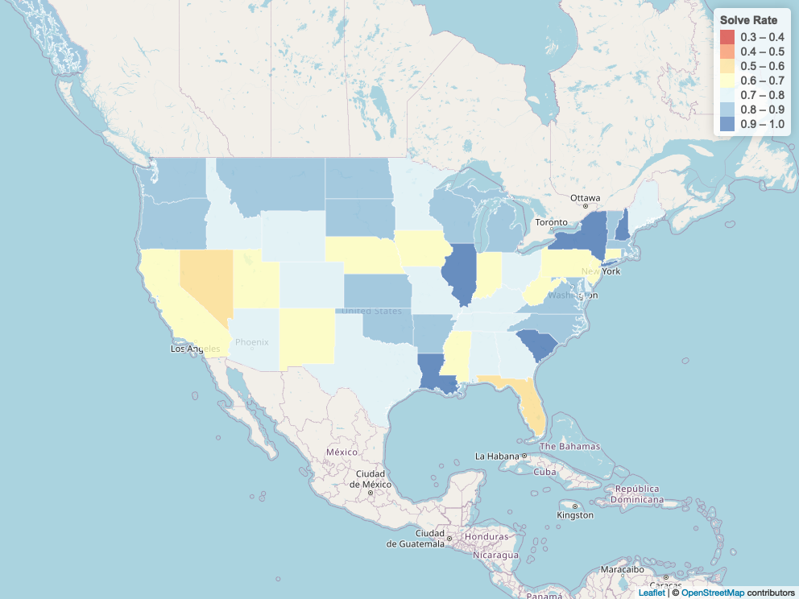

```{r setup, include=FALSE}
knitr::opts_chunk$set(echo = TRUE)
```

## R Markdown

This is an R Markdown document. Markdown is a simple formatting syntax for authoring HTML, PDF, and MS Word documents. For more details on using R Markdown see <http://rmarkdown.rstudio.com>.

When you click the **Knit** button a document will be generated that includes both content as well as the output of any embedded R code chunks within the document. You can embed an R code chunk like this:

```{r include=FALSE}

library(leaflet)
library(htmltools)
library(dplyr)
library(terra)
library(mapview)

fbi_data <- readRDS("R Leaflet/data/database.rds")

us <- fbi_data %>% 
  mutate(Solved = ifelse(Crime.Solved == "Yes", 1, 0)) %>% 
  filter(Crime.Type == "Murder or Manslaughter") %>% 
  group_by(State) %>% 
  summarise(Num.Murders = n(),
            Num.Solved = sum(Solved)) %>% 
  mutate(Num.Unsolved = Num.Murders - Num.Solved,
         Solve.Rate = Num.Solved/Num.Murders)

states <- vect("R Leaflet/data/cb_2016_us_state_500k/cb_2016_us_state_500k.shp") #terra
#states1 <- st_read("R Leaflet/data/cb_2016_us_state_500k/cb_2016_us_state_500k.shp") #sf

is.element(us$State, states$NAME)

levels(us$State)[40] <- "Rhode Island"

states <- subset(states, is.element(states$NAME, us$State))

#us <- us[order(match(us$State, states$NAME))]

bins <- seq(0.3, 1.0, 0.1)
pal <- colorBin("RdYlBu", domain = us$Solve.Rate, bins = bins)

labels <- paste("<p>", "State: ", us$State, "</p>",
                "<p>", "Solve Rate: ", round(us$Solve.Rate, 3), "</p>", sep = "")

m <- leaflet() %>% 
  setView(-96, 37.8, 4) %>% 
  addProviderTiles(providers$OpenStreetMap) %>% 
  addPolygons(data = states,
              weight = 1,
              smoothFactor = 0.5,
              color = "white",
              fillOpacity = 0.8,
              fillColor = pal(us$Solve.Rate),
              highlight = highlightOptions(
                weight = 5,
                color = "#666666",
                #dashArray = "",
                fillOpacity = 0.7,
                bringToFront = TRUE
              ),
              label = lapply(labels, HTML)) %>% 
  addLegend(pal = pal,
            values = us$Solve.Rate,
            opacity = 0.7,
            position = "topright",
            title = "Solve Rate")
mapshot(x = m, file = "static.png")
```



